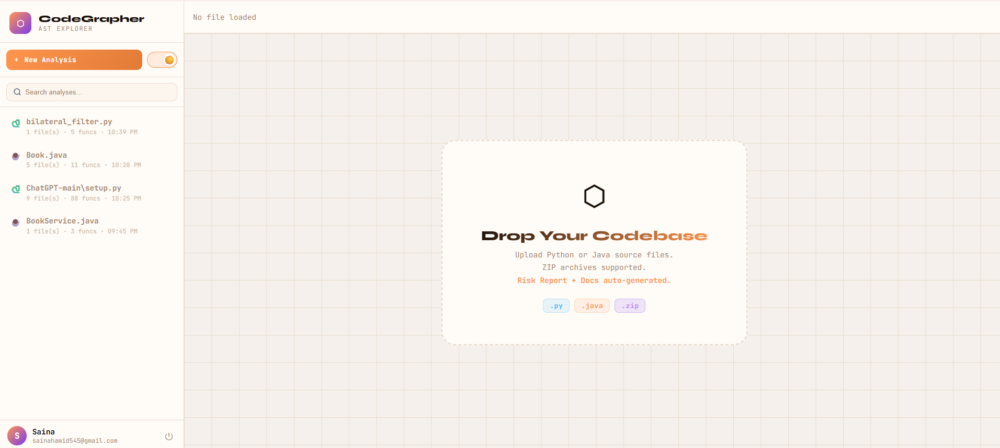
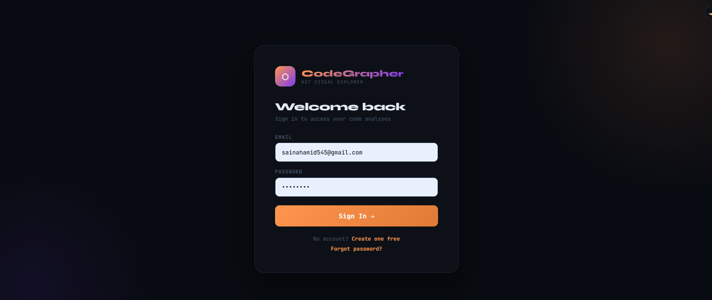
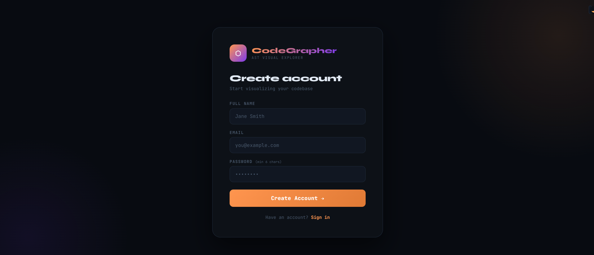
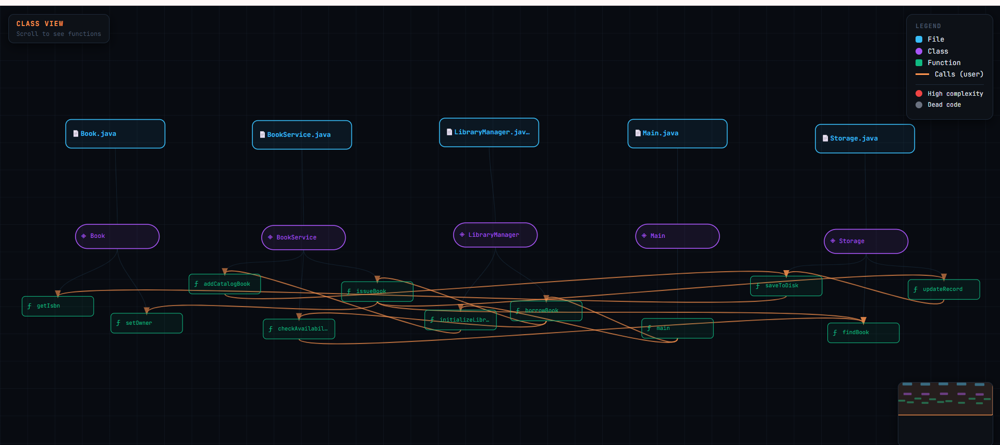
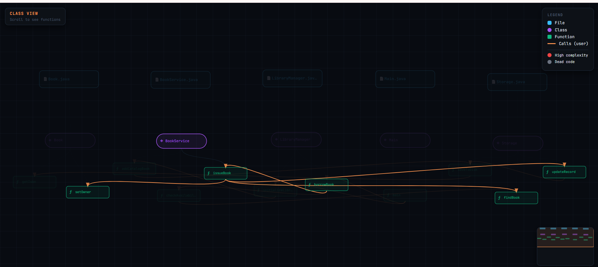
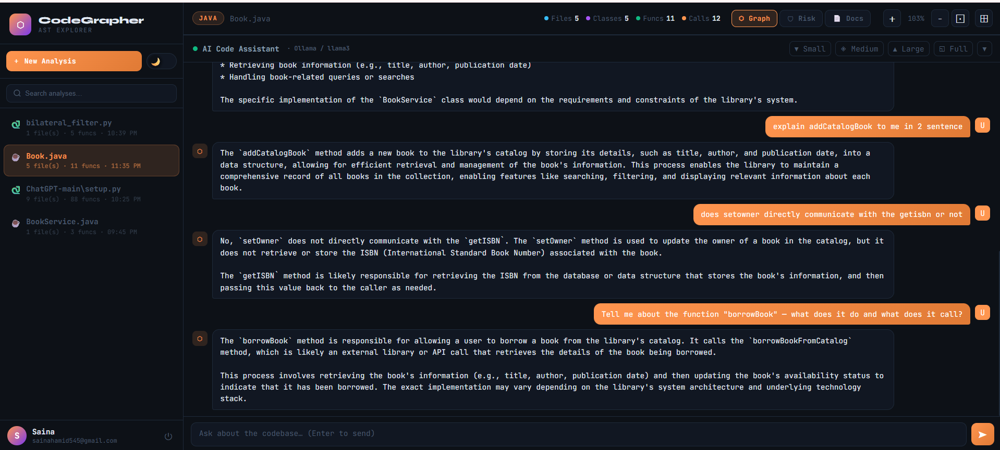
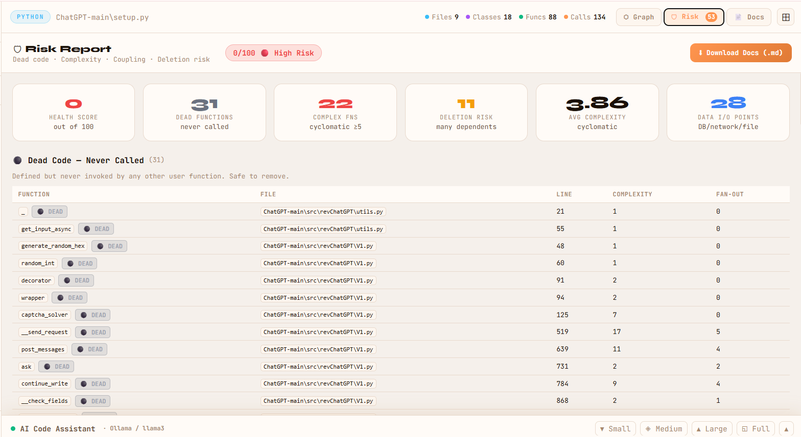
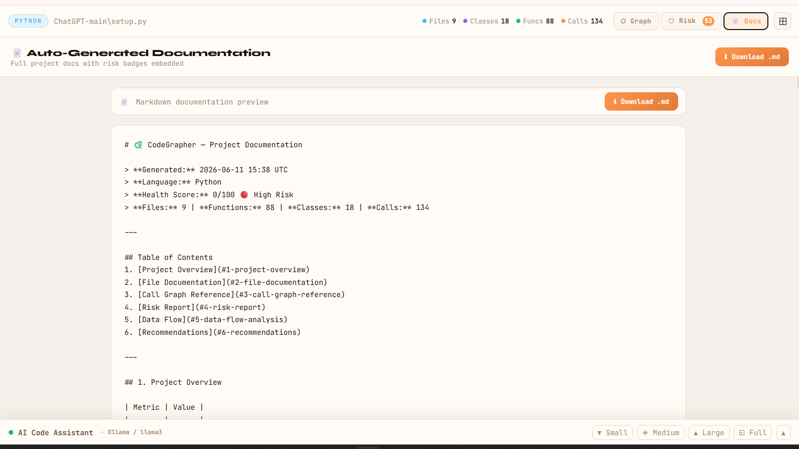

# ⬡ CodeGrapher

> **An AI-Powered Platform to Visualize, Analyze, and Understand Codebases using Static Analysis and Hybrid GraphRAG**


---

## Overview

Developers often spend a significant amount of time understanding existing codebases before making modifications or contributing to a project. While Large Language Models (LLMs) can assist with code explanations, they frequently struggle with large repositories due to context window limitations and may hallucinate dependencies, relationships, or architectural details.

**CodeGrapher** addresses this challenge by combining **deterministic static analysis**, **semantic Retrieval-Augmented Generation (RAG)**, and **graph-based context expansion** into a single repository understanding platform.

The system first analyzes the repository using Abstract Syntax Tree (AST) analysis to extract functions, classes, dependencies, software metrics, and potential code risks. It then indexes function-level code chunks into **ChromaDB** using locally generated embeddings. When a developer asks a question, CodeGrapher performs **semantic retrieval** to identify the most relevant code, enriches it with related callers and callees from the dependency graph, and generates repository-aware explanations using a local LLM.

The result is an AI-powered platform that enables developers to **visualize software architecture, analyze repository structure, and understand complex codebases** through accurate, context-aware explanations.

---

# Problem Statement

Understanding large software repositories is difficult because:

- Large codebases contain hundreds or thousands of interconnected functions.
- Traditional static analysis tools only generate graphs and metrics without explaining them.
- LLMs cannot process entire repositories due to context window limitations.
- Keyword-based retrieval often fails when users describe concepts differently from the source code.
- AI assistants without repository awareness frequently hallucinate or miss execution flow.

CodeGrapher addresses these challenges by combining repository analysis with semantic retrieval and graph-aware context expansion.

---

# Motivation

This project was developed to improve software comprehension by providing developers with both structural and semantic understanding of a repository.

Instead of forcing developers to manually navigate dependency graphs and source files, CodeGrapher allows them to ask natural language questions while leveraging:

- Static code analysis
- Semantic retrieval
- Dependency graph expansion
- Local LLM reasoning

This significantly reduces the effort required to understand unfamiliar codebases.

---

# Key Features

## Static Analysis

- AST-based Python analysis
- Java source code analysis using Java parser
- Function extraction
- Class extraction
- Import analysis
- Method extraction
- Call graph generation
- Dependency graph generation

---

## Repository Visualization

- Interactive dependency graph
- Function-level relationships
- Class hierarchy visualization
- Graph navigation
- Clickable nodes
- Interactive exploration of repository structure

---

## Hybrid GraphRAG

Unlike traditional RAG systems, CodeGrapher combines:

- Semantic Retrieval
- Call Graph Expansion
- Static Analysis Metadata

The retrieval pipeline works as follows:

```

User Question
│
▼
Embedding Generation
│
▼
Semantic Search (ChromaDB)
│
▼
Top-K Relevant Functions
│
▼
Graph Expansion
(Callers + Callees)
│
▼
Repository Context
│
▼
LLM Response

```

This provides significantly richer context than semantic retrieval alone.

---


## Static Code Metrics

CodeGrapher automatically computes:

- Cyclomatic Complexity
- Fan-In
- Fan-Out
- Coupling
- Instability
- Dead Code Detection
- God Function Detection
- Data Entry/Exit Analysis
- Risk Report
- Repository Health Score

---

## Automated Documentation

Automatically generates:

- Markdown Documentation
- Function Reference
- Call Graph Reference
- Risk Report
- Complexity Report
- Recommendations
- Project Summary

---


# System Architecture

```

                    Upload Repository
                            │
                            ▼
                 Static Code Analysis
                            │
        ┌───────────────────┴──────────────────┐
        ▼                                      ▼
 Call Graph Generation               Function Extraction
        │                                      │
        └───────────────┬──────────────────────┘
                        ▼
                 Function Chunking
                        │
                        ▼
          Generate Embeddings (Ollama)
                        │
                        ▼
             Store in ChromaDB
────────────────────────────────────────────────────

                User Question
                        │
                        ▼
           Generate Query Embedding
                        │
                        ▼
        Semantic Search (Top-K Chunks)
                        │
                        ▼
      Graph Expansion (Callers/Callees)
                        │
                        ▼
             Build Repository Context
                        │
                        ▼
                   Ollama LLM
                        │
                        ▼
                Repository Explanation

```

---

# Technology Stack

| Category | Technologies |
|----------|--------------|
| Frontend | HTML, CSS, Vanilla JavaScript |
| Backend | Flask |
| Static Analysis | Python AST, Java Parser |
| Vector Database | ChromaDB |
| Embedding Model | nomic-embed-text |
| Local LLM | Ollama (Llama 3.2) |

---

# Project Structure

```

CodeGrapher
│
├── app.py
├── analyze.py
├── llm.py
├── templates/
├── static/
├── uploads/
├── images/
├── reports/
└── requirements.txt

```

### Core Modules

| File | Responsibility |
|------|----------------|
| `app.py` | Flask application and API routes |
| `analyze.py` | Static analysis engine for Python and Java repositories |
| `llm.py` | Hybrid GraphRAG pipeline, semantic retrieval, prompt generation and Ollama communication |
| `templates/` | Frontend pages |
| `static/` | CSS, JavaScript and visualization assets |
| `reports/` | Generated documentation and reports |

---

# Installation

## Clone Repository

```bash
git clone https://github.com/<username>/CodeGrapher.git

cd CodeGrapher
```

## Create Virtual Environment

```bash
python -m venv venv
```

Windows

```bash
venv\Scripts\activate
```

Linux / macOS

```bash
source venv/bin/activate
```

## Install Dependencies

```bash
pip install -r requirements.txt
```

## Install Ollama

Download Ollama from

https://ollama.com/

Pull the required models:

```bash
ollama pull llama3.2:1b

ollama pull nomic-embed-text
```

Start Ollama

```bash
ollama serve
```

---

# Running the Application

Start the Flask server:

```bash
python app.py
```

Open your browser and navigate to:

```
http://localhost:5000
```

---


# User Interface

## Homepage

The homepage provides repository upload functionality and allows users to select the programming language before analysis.

### Light Theme

<p align="center">

</p>

---

### Dark Theme

<p align="center">

</p>

---

# Authentication

## Login

<p align="center">

</p>

---

## Register Account

<p align="center">

</p>

---

# Interactive Dependency Graph

After analysis, CodeGrapher generates an interactive dependency graph that visualizes relationships between functions and classes.

Developers can:

- Explore dependencies
- Inspect callers and callees
- Understand execution flow
- Navigate large repositories visually

---

## Dependency Graph

<p align="center">

</p>

---

## Expanded Dependency Graph

<p align="center">

</p>

---

# AI Repository Assistant

Developers can ask repository-aware questions using natural language.

Example questions include:

- Explain this function.
- How does user authentication work?
- Which functions call this method?
- Explain the execution flow.
- What happens if this function is deleted?
- Which functions access the database?
- Which functions are most complex?

The assistant answers using:

- Static Analysis
- Semantic Retrieval
- Graph Expansion
- Local LLM

rather than relying only on raw source code.

---

## Chat Interface

<p align="center">

</p>

---

# Risk Analysis

CodeGrapher automatically detects potential maintenance risks, including:

- Dead Functions
- High Complexity Functions
- God Functions
- High Fan-In Dependencies
- Data Entry / Exit Functions

It also generates an overall **Repository Health Score** to help developers quickly assess software quality.

---

## Risk Report

<p align="center">

</p>

---

# Automated Documentation

The system automatically generates comprehensive Markdown documentation containing:

- Project Summary
- File Documentation
- Function Documentation
- Call Graph Reference
- Complexity Report
- Risk Report
- Recommendations

This significantly reduces manual documentation effort.

---

## Generated Documentation

<p align="center">

</p>

---


# Future Enhancements

Future improvements include:

- Multi-language repository analysis
- C/C++ support
- JavaScript and TypeScript support
- GitHub integration
- Docker deployment
- Role-based authentication
- Multi-user collaboration
- AI-powered code refactoring suggestions


---

# Research Contribution

CodeGrapher combines multiple software engineering and AI techniques into a unified repository understanding platform.

The project integrates:

- Static Program Analysis
- Abstract Syntax Trees (AST)
- Dependency Graph Construction
- Function-Level Code Chunking
- Semantic Retrieval-Augmented Generation (RAG)
- ChromaDB Vector Search
- Local Embedding Generation
- Graph-Based Context Expansion
- Local Large Language Models

This combination enables repository-aware AI explanations while maintaining deterministic structural analysis.

---

# Contributors

Developed by:

**Saina Hamid**
# Acknowledgements


This project is inspired by work in:

- Static Program Analysis
- Abstract Syntax Trees (AST)
- Repository-Level Code Understanding
- Retrieval-Augmented Generation (RAG)
- GraphRAG
- Semantic Code Search

---


</p>